Flexplorer
==========


Vývojářský nástroj pro AbraFlexi API. Napsaný s využitím knihovny [PHP AbraFlexi](https://github.com/Spoje-NET/php-abraflexi)
Umožňuje:

  * Pracovat s formáty JSON,XML a CSV
  * zobrazovat obsah všech dostupných evidencí ve všech firmách
  * zobrazovat strukturu evidence
  * odesílat přímé požadavky na server a zobrazovat výsledky
  * Nastavovat ChangesAPI a přidávat WebHooks
  * Zobrazovat data změn přijatá z ChangesAPI
  * Zasílat přijatá data změn na url webhooku aplikace a zobrazit problémy
  * Test odpovědi WebHook skriptu zpracovávajícího změny z AbraFlexi
  * Hromadně zakládat a rušit účetní období
  * Rozlišit evidnece které jsou z důvodu licence nedostupné
  * Zobrazovat vedle json výsledku požadavku i stránku z AbraFlexi
  * Zobrazovat PDF náhled editovaného dokladu
  * Upravovat Externí ID záznamů
  * Měnit stav přiřazení štítků k evidenci
  * Doplnit AbraFlexi GUI o tlačítka odkazující do FlexPloreru
  * Zakládat a mazat firmy
  * Resetovat firmu (smazat a znovu založit )
  * Klonovat firmu
  * Uložit a znovu načíst výchozí zálohu firmy
  * Filtrovat záznamy dle ID nebo Externího ID
  * Definovat Uživatelská tlačítka
  * Zobrazovat oprávnění k rolím
  * Zobrazovat PDF tiskové sestavy k záznamu i výpisu evidence
  

[](https://github.com/VitexSoftware/Flexplorer)
[](https://github.com/VitexSoftware/Flexplorer/releases)
[](https://github.com/VitexSoftware/Flexplorer/blob/master/LICENSE)
[](https://travis-ci.org/VitexSoftware/Flexplorer)
[](https://coveralls.io/r/VitexSoftware/Flexplorer?branch=master)

Vyzkoušejte: 

  * Stabilní verze: http://flexplorer.vitexsoftware.com/ (vždy funguje)
  * Vývojová verze: https://vitexsoftware.cz/flexplorer/ ( poslední novinky )

Instalace
---------

Pro Debian či Ubuntu prosím použijte [repozitář](http://vitexsoftware.cz/repos.php):

```shell
sudo apt install lsb-release wget
echo "deb http://repo.vitexsoftware.cz $(lsb_release -sc) main" | sudo tee /etc/apt/sources.list.d/vitexsoftware.list
sudo wget -O /etc/apt/trusted.gpg.d/vitexsoftware.gpg http://repo.vitexsoftware.cz/keyring.gpg
sudo apt update
sudo apt install flexplorer
```	                

Poté budou zobrazeny dialogy pro zadání výchozího serveru, jména a hesla.
Takto zadané údaje budou zapsány do konfiguráku aplikace a nabízeny jako 
předvyplněné.


Po instalaci balíčku a reloadu webserveru bude aplikace nainstalována do složky 
/usr/share/flexplorer a dostupná jako http://localhost/flexplorer/ 
( konfigurováno v  /etc/apache2/conf-enabled/flexplorer.conf ) 
Pokud je nainstalován démon avahi, bude tento propagovat aplikaci jako službu.
Aplikaci je pak možné spustit z nabídky programů v sekci "programování"


Přihlášení
----------

Nepřihlášený uživatel je přesměrován na stránku login.php s přihlašovacím dialogem. Zde je možné vyplnit přihlašovací údaje, nebo kliknot na link v záložkách po levé straně.
Novou záložku je možné přidat buď volbou přepínače pod přihlašovacím dialogem nebo přidáním json souboru do složky /etc/abraflexi/. 
Formát těchto souborů musí být kompatibilní s https://github.com/VitexSoftware/abraflexi-client-config tzn.

```json
{
    "ABRAFLEXI_URL": "https:\/\/demo.abraflexi.eu:5434",
    "ABRAFLEXI_LOGIN": "winstrom",
    "ABRAFLEXI_PASSWORD": "winstrom",
    "ABRAFLEXI_COMPANY": "demo"
}
```

Nově je také možné se přihašovat přímo do aplikace s použitím url serveru a authtokenu. Ukázková adresa vypadá takto:

evidence.php?serveruri=https%3A%2F%2Fdemo.abraflexi.eu%3A5434&


Aktualizace
-----------

Pokud máte balíček nainstalovný ze zdroje, aktualizace probíhají tak jak je v debianu zvykem: 


Vagrant
-------
K dispozici je také [Box](https://atlas.hashicorp.com/vitexsoftware/boxes/flexplorer) pro Vagrant. Po doběhnutí příkazu

    vagrant init vitexsoftware/flexplorer; vagrant up --provider virtualbox

bude možné aktuální vývojovou zobrazit na adrese [http://localhost:8080/src/]
a verzi z nejnovějšího debianího balíčku na adrese [http://localhost:8080/flexplorer/]


Docker
------

K dispozici je také obraz pro docker. Následující příkaz zpřístupní FlexPlorer na adrese: [localhost:2323](http://0.0.0.0:2323/)

    docker run  -dit --name flexplorer -p 2323:80 vitexsoftware/flexplorer

```    
vitex@docker:~$ docker run  -dit --name flexplorer -p 2323:80 vitexsoftware/flexplorer
Unable to find image 'vitexsoftware/flexplorer:latest' locally
latest: Pulling from vitexsoftware/flexplorer
cc1a78bfd46b: Pull complete 
1cd0b77f3d1d: Pull complete 
9b851b09757c: Pull complete 
9b36fad49c61: Pull complete 
d0e15216409e: Pull complete 
da8507a1fa91: Pull complete 
1285ef6f4076: Pull complete 
07c17144f477: Pull complete 
058b8f440dad: Pull complete 
507722a10e0a: Pull complete 
f3440e09e483: Pull complete 
967168855bae: Pull complete 
da8a7cb827b5: Pull complete 
Digest: sha256:38ed8bd94aaf2e57877c8b207cd55bb486d09178dacbd0b4def87090cae6170b
Status: Downloaded newer image for vitexsoftware/flexplorer:latest
396261e16a3adb66faf8f63a3f518b3c10331cc9c0f575c73cd86df3899b8f87
```


Konfigurace
-----------

Konfigurační soubor config.php se náchází ve složce src/includes. Výchozí konfigurace vypadá takto:

    define('LOG_NAME', 'Flexplorer'); //Identifikace logu
    define('LOG_TYPE', 'syslog'); //Možné hodnoty: memory, syslog, file

    /*
     * Výchozí odesilatel zpráv
     */
    define('EMAIL_FROM', 'flexplorer@localhost');

    /*
     * URL AbraFlexi API
     */
    define('DEFAULT_ABRAFLEXI_URL', 'https://demo.flexibee.eu');
    /*
     * Uživatel AbraFlexi API
     */
    define('DEFAULT_ABRAFLEXI_LOGIN', 'winstrom');
    /*
     * Heslo AbraFlexi API
     */

    define('DEFAULT_ABRAFLEXI_PASSWORD', 'winstrom');
    /*
     * Společnost v AbraFlexi
     */

    define('DEFAULT_ABRAFLEXI_COMPANY', 'demo');


Poděkování
----------

Vznik tohoto nástroje by nebyl možný bez laskavé podpory společnosti [Spoje.Net](http://www.spoje.net), 

U společnosti Spoje.Net, je možné si objednat komerční podporu pro integraci
knihovny [PHP AbraFlexi](https://github.com/Spoje-NET/FlexiPeeHP) do vašich projektů. 


[Statistiky Projektu na Wakatime](https://wakatime.com/@5abba9ca-813e-43ac-9b5f-b1cfdf3dc1c7/projects/wvloiziluw)

Obrázky aplikace
================

Pro přihlášení se používá jména a hesla uživatele aplikace s oprávněním používat REST API. Záložky po levé straně jsou načítány z konfigruračních souborů ve složce /etc/abraflexi/


FlexPlorer zobrazuje odpověď požadavku:


Je možné si zvolit libovolnou evidenci AbraFlexi a její obsah si vypsat:


Data můžeme editovat a uložit, pokud k tomu má přihlášený uživatel práva:

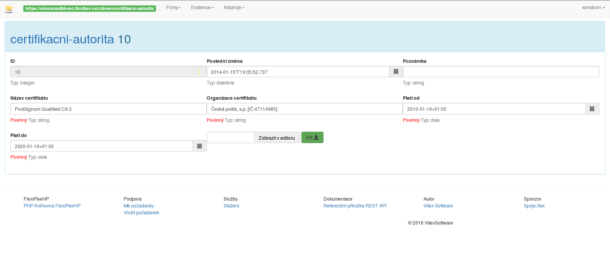

Nad otevřenou evidencí je možné snadno provádět dotazy:

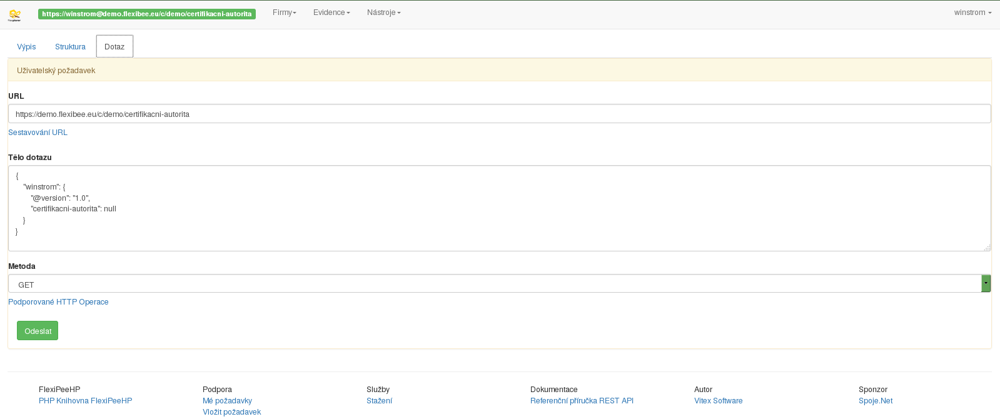

Smazání záznamu z evidence je třeba potvrdit:

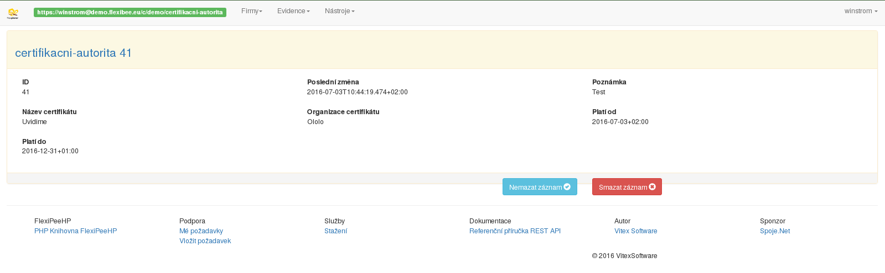

Při testování WebHooku pomůže tento nástroj, který sestaví maketu záznamu ChangesAPI a odešle jí na zvolený WebHook:

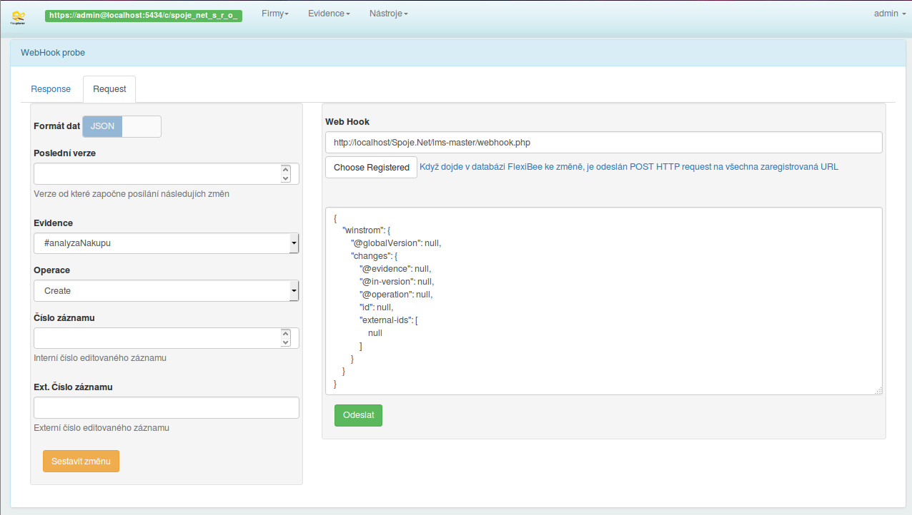

Je možné také použít data změn došlá na webhook FlexPloreru a zvolit si na který webhook testované aplikace budou tato odesílána:

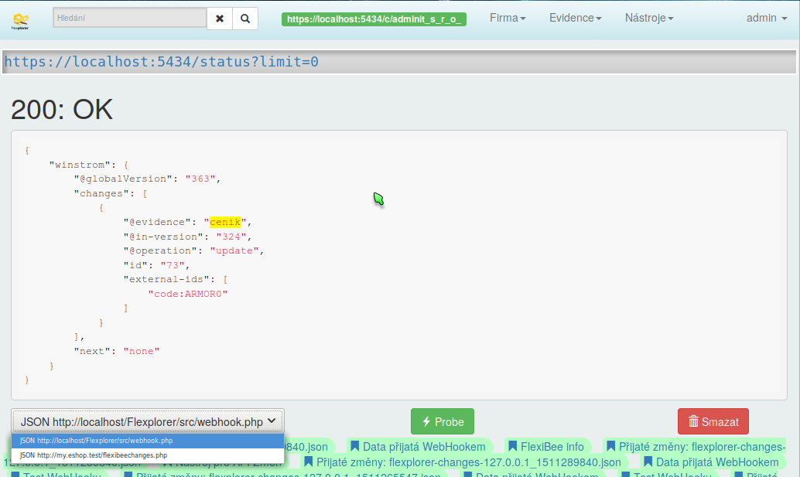

Správná je prázdná odpověď. Ačkoliv funguje, tak by se tento skript AbraFlexi nelíbil. Zde vidíme co vrací:

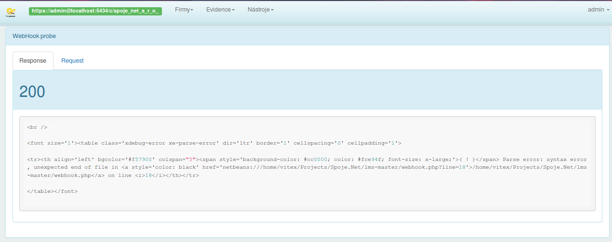

Pro hledání v evidencích je k dispozici vyhledávací políčko:

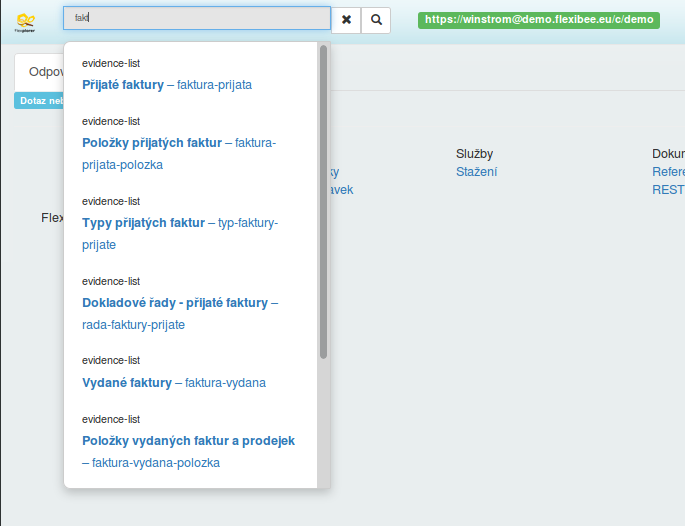

Po stisku entru se zobrazí podrobnější výsledky:

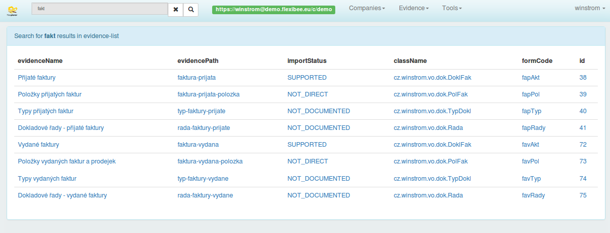

Vyhledávat je také možné v názvech sloupců jednotlivých evidencí a jejich popiscích:

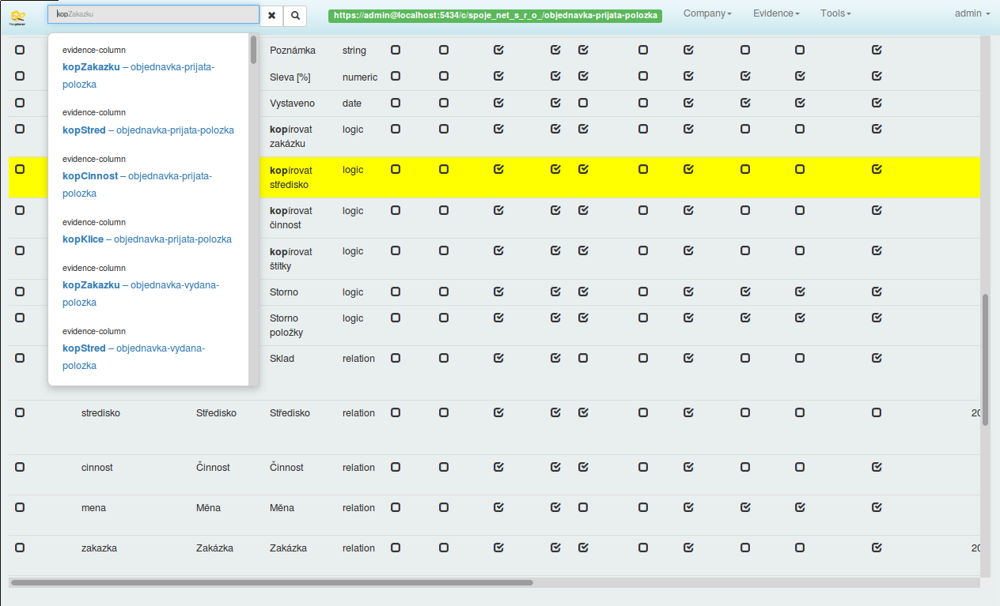

Tělo požadavku je možné načítat ze souboru:

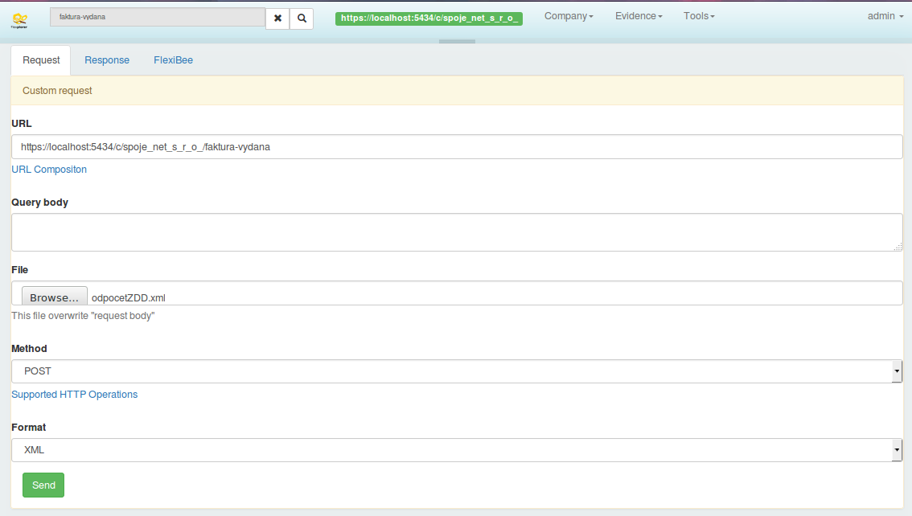

Odpověď požadavku může být v podporovaných formátech (zde XML):

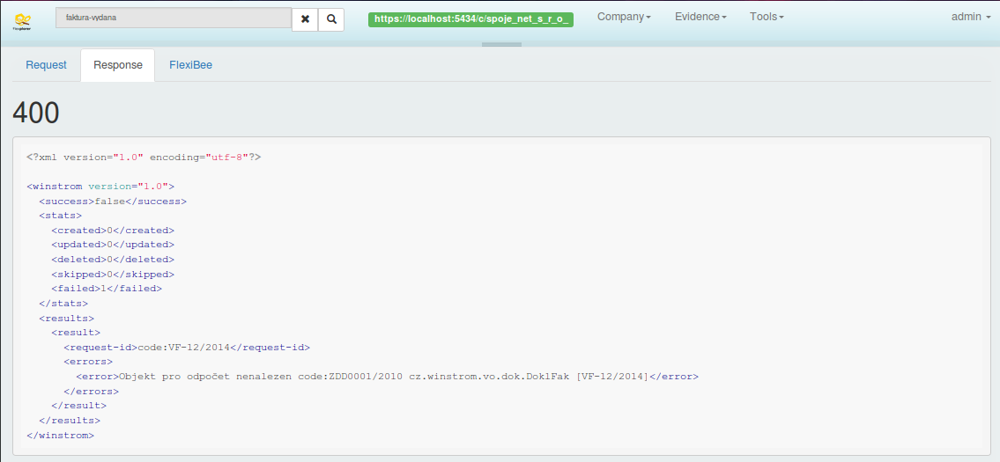

Základní přehled firmy

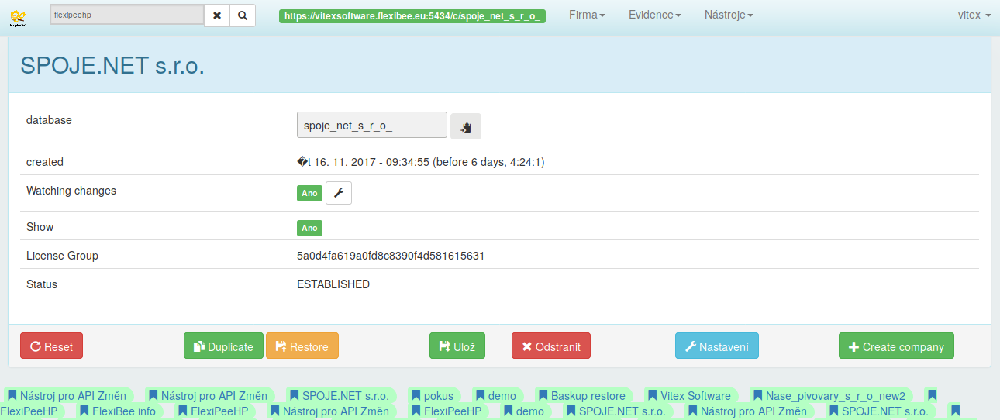

